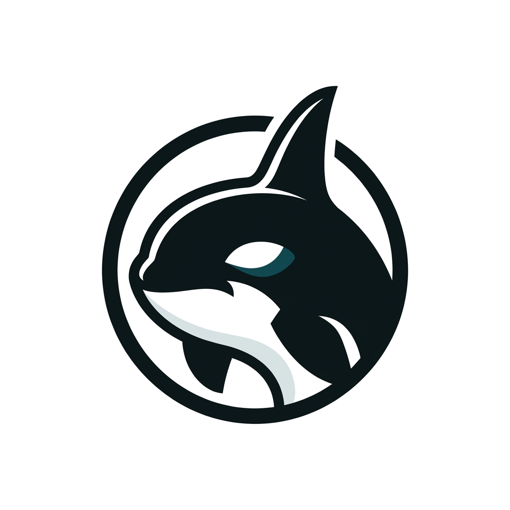
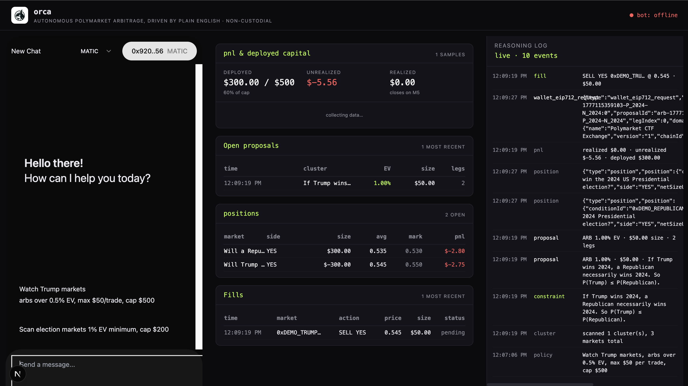

<p align="center">
  
</p>

<h1 align="center">Orca</h1>

<p align="center"><b>Observe · Reason · Correlate · Act</b></p>

<p align="center"><i>Autonomous arbitrage on Polymarket, driven by plain English. Non custodial by design. Your key signs. The agent only proposes.</i></p>

---

Type one English sentence. An autonomous agent trades correlated Polymarket markets while you sleep. The chat surface, the wallet handoff, and the wallet event bus are built on [aomi](https://github.com/aomi-labs). `<AomiFrame>` is installed via the shadcn registry. The wallet request queue runs inside `AomiRuntimeProvider` from `@aomi-labs/react`. EIP-712 payloads flow through a swappable auth adapter (wagmi today, Para tomorrow).

> *Type one sentence. The agent scans the live orderbook, reasons about correlations, proposes arbs with visible reasoning, and executes non custodially. Every decision is auditable. Your key signs. The agent only proposes.*

<p align="center">
  
</p>

<p align="center">
  <a href="https://youtu.be/b8aPweQHPL0"><b>▶ Watch the demo on YouTube</b></a>
</p>

## One pager

The submission one pager lives in this repo as **[How I Built Orca.md](./How%20I%20Built%20Orca.md)** — the full build story, the architecture decisions, and the tradeoffs.

## Documentation

Full reference lives in **[apps/docs](./apps/docs)** and is served locally at **[http://localhost:3001](http://localhost:3001)** when you run `pnpm dev`. Highlights:

- **Quickstart** · install, run, paste your first policy
- **User flow** · what the demo looks like in the browser, with screenshots
- **Going live** · swap the fixture for live Polymarket data and watch real fills
- **Built on aomi** · the exact aomi pieces Orca uses and how to extend them
- **Architecture** · the full request path, every component named
- **Tradeoffs** · what changed during the build and why

The long form build story — and the submission one pager — lives in **[How I Built Orca.md](./How%20I%20Built%20Orca.md)**.

---

## Quickstart (under 5 minutes)

You need three things installed:

- **Node 20+** and **pnpm 9+**
- **Bun 1.1+** · `curl -fsSL https://bun.sh/install | bash`
- **MetaMask** in your browser (any other injected wallet works too)

Then:

```bash
# 1. Clone and install
git clone <this-repo> orca
cd orca
pnpm install

# 2. Copy the env template (no editing needed for the offline demo)
cp .env.example .env

# 3. Boot everything
pnpm dev
```

That last command starts four processes in parallel:

| Process | URL | Role |
|---|---|---|
| `apps/web` | [localhost:3000](http://localhost:3000) | Dashboard + aomi widget — open this first |
| `apps/docs` | [localhost:3001](http://localhost:3001) | Docusaurus reference |
| `apps/bot` | localhost:8787 | The bot (scan loop, reasoning, execution, SSE) |
| `apps/mock-aomi` | localhost:8080 | Protocol shim between the widget and the bot |

Open **[localhost:3000](http://localhost:3000)**, connect MetaMask, paste a policy in the chat, and watch the reasoning log stream. The default `.env` runs the whole pipeline offline against a fixture, so **no API key and no USDC are required to see it work**.

> **Want LLM-parsed policies instead of the canned default?** Grab a free Gemini key at [aistudio.google.com/apikey](https://aistudio.google.com/apikey) and paste it into `GEMINI_API_KEY=` in `.env`. Restart `pnpm dev`.

---

## What you will see

The default `.env` ships with `DEMO_MODE=replay` and `EXECUTION_MODE=dry`, so the pipeline runs end to end **offline, with no USDC at risk**.

1. **Policy parsed.** Your English sentence becomes a structured `Policy` with caps (`minEV`, `maxPerTrade`, `maxTotal`).
2. **Scanner.** Emits a cluster of three correlated markets from a baked in fixture.
3. **Constraint extractor.** Identifies `P(Trump wins) ≤ P(Republican wins)`.
4. **Arb math.** Finds the 100 bps violation in the fixture's orderbook.
5. **Executor.** Emits a `wallet_eip712_request` over SSE.
6. **Auth adapter.** Routes to MetaMask (or Para if configured) and signs.
7. **Fill, position, PnL.** Tracked in SQLite, streamed to the dashboard.

To run against live Polymarket.

```bash
DEMO_MODE=live pnpm dev
```

To submit real orders (requires a wallet plus USDC on Polygon).

```bash
DEMO_MODE=live EXECUTION_MODE=live NEXT_PUBLIC_SIGNER_MODE=live pnpm dev
```

The kill switch at the top of the dashboard halts the loop and cancels any in flight signature requests.

---

## Monorepo layout

```
aiomi/
├─ apps/
│  ├─ bot/          # the bot (runs on Bun)
│  │  └─ src/
│  │     ├─ index.ts               # HTTP, SSE, scan loop, /sign, /kill
│  │     ├─ policy/parser.ts       # Gemini policy parser
│  │     ├─ scanner/               # Gamma + CLOB live, fixture replay
│  │     ├─ reasoning/             # Flash grouper, Pro constraint extractor, pure arb math
│  │     ├─ execution/             # build CTF Exchange order, await sign, submit to Polymarket CLOB
│  │     └─ tracker/               # bun:sqlite positions and PnL
│  ├─ web/          # Next.js 15 dashboard + <AomiFrame/>
│  ├─ mock-aomi/    # protocol shim between widget and bot
│  └─ docs/         # Docusaurus v3
├─ packages/
│  ├─ shared-types/ # zod schemas (Policy, Constraint, ArbProposal, Fill, …)
│  ├─ aomi-bridge/  # CTF Exchange order builder. Swaps to the aomi-transact skill when aomi ships the runtime.
│  └─ ui/           # shadcn primitives
└─ scripts/         # seed-demo, replay
```

---

## Verification

```bash
# Unit, 20 policy fixtures against Gemini
pnpm --filter bot test:parser

# Offline pipeline, fixture → full reasoning chain → proposal
pnpm --filter bot replay

# Typecheck everything
pnpm typecheck
```

---

## Architecture at a glance

```
English policy ──► Gemini parser ──► structured Policy
                                         │
                                         ▼
Gamma REST + CLOB REST ──► MarketSnapshot[]
                                         │
                                         ▼
           Gemini 2.5 Flash (correlation grouper)
                                         │
                                         ▼
           Gemini 2.5 Pro (constraint extractor)
                                         │
                                         ▼
             Pure arb math (EV + Kelly bounded size)
                                         │
                                         ▼
         Cap enforcement (SQLite deployed capital counter)
                                         │
                                         ▼
    wallet_eip712_request ──► aomi auth adapter ──► CLOB
                                         │
                                         ▼
                        SQLite fills → positions → PnL snapshots
                                         │
                                         ▼
                       SSE → dashboard (positions, fills, PnL, reasoning)
```

The aomi ingredients plug in at the boundaries. `<AomiFrame>` owns the chat and the wallet pill on the web side. The `wallet_*_request` event bus is the non custodial handoff. The auth adapter contract makes the underlying signer (MetaMask, Para, hardware wallet, embedded wallet) interchangeable.

---

## Safety

- **Caps enforced before every emit.** Total deployed USDC is recomputed from SQLite every cycle and gated against `policy.maxTotal`.
- **Session signer envelope.** When the user authorises Para, the MPC enclave co signs only inside the envelope (amount and time window). One click revocation.
- **Kill switch.** `POST /kill` halts the scan loop and rejects every in flight signature request.
- **Replay mode.** The whole pipeline runs offline against a fixture. Reproducible demos, no USDC moves.
- **Hallucination defence.** LLM citations use market numbers, remapped server side to conditionIds. The model cannot fabricate a market.

---

## License

MIT (placeholder, confirm before publishing).
